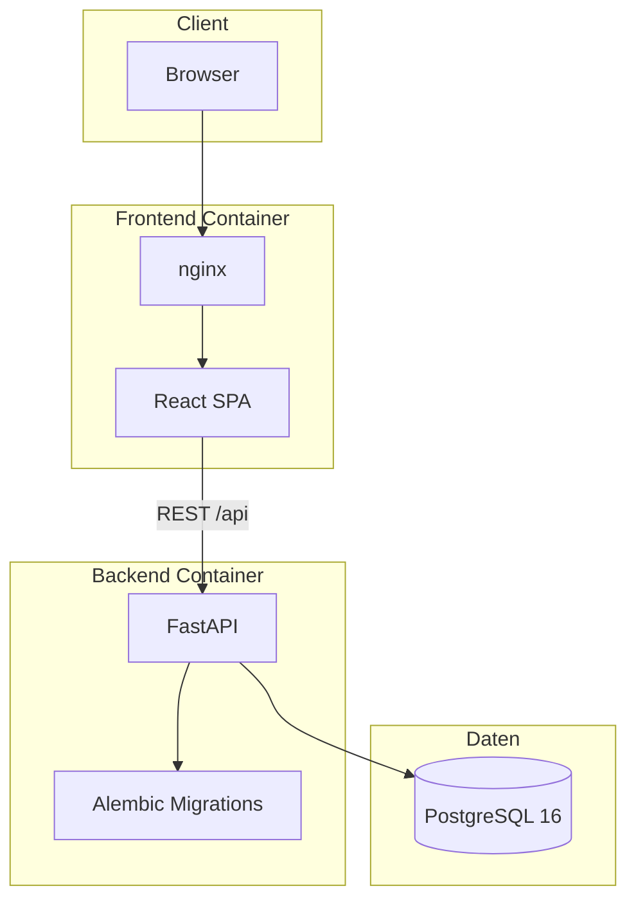

# Architektur

## Komponenten



| Schicht | Technologie | Port |
|---------|-------------|------|
| Frontend | React, TypeScript, Vite, nginx | 80 (Container) |
| Backend | FastAPI, SQLAlchemy async, Alembic | 8000 |
| Datenbank | PostgreSQL 16 | 5432 |

## Verzeichnisstruktur

```
prompt-db/
├── backend/
│   ├── app/              # FastAPI-Anwendung
│   ├── alembic/          # DB-Migrationen
│   ├── Dockerfile
│   └── entrypoint.sh     # Migration + Seed beim Start
├── frontend/
│   ├── src/              # React UI
│   ├── nginx.conf.template
│   └── Dockerfile
├── k8s/                  # Kubernetes-Manifeste
├── scripts/              # Hilfsskripte
├── docs/                 # Dokumentation
├── docker-compose.yml
├── VERSION               # Semver (Single Source of Truth)
└── .github/workflows/    # GitHub Actions CI/CD
```

## Authentifizierung

- JWT Access Token (kurzlebig) + Refresh Token (Rotation mit `jti` in DB)
- Passwort-Hashing mit bcrypt
- Rate Limiting auf Auth-Endpunkten

## Prompt-Modell

| Feld | Beschreibung |
|------|--------------|
| Titel, Text, Beschreibung | Inhalt |
| Modell | Freitext / aus Meta-Liste |
| Aufgabe (`task`) | Kategorisierung |
| Tags | Liste |
| Sichtbarkeit | `private` oder `public` |

Private Prompts sind nur für den Besitzer sichtbar. Fremde Ressourcen liefern **404** (kein Information Leak via 403).

## API

Basis-URL: `/api`

| Methode | Pfad | Auth |
|---------|------|------|
| POST | `/auth/register` | Nein |
| POST | `/auth/login` | Nein |
| POST | `/auth/refresh` | Refresh Token |
| GET | `/auth/me` | Ja |
| GET/POST | `/prompts` | Ja |
| PATCH/DELETE | `/prompts/{id}` | Owner |
| GET | `/meta` | Nein |

OpenAPI unter `/docs` nur in `ENVIRONMENT=development`.

## Container-Images

Zwei getrennte Images:

- **prompt-db-backend** – Python-App, führt Migrationen beim Start aus
- **prompt-db-frontend** – Statisches Build + nginx mit CSP

Build und Versionierung: [ci-cd.md](./ci-cd.md)
