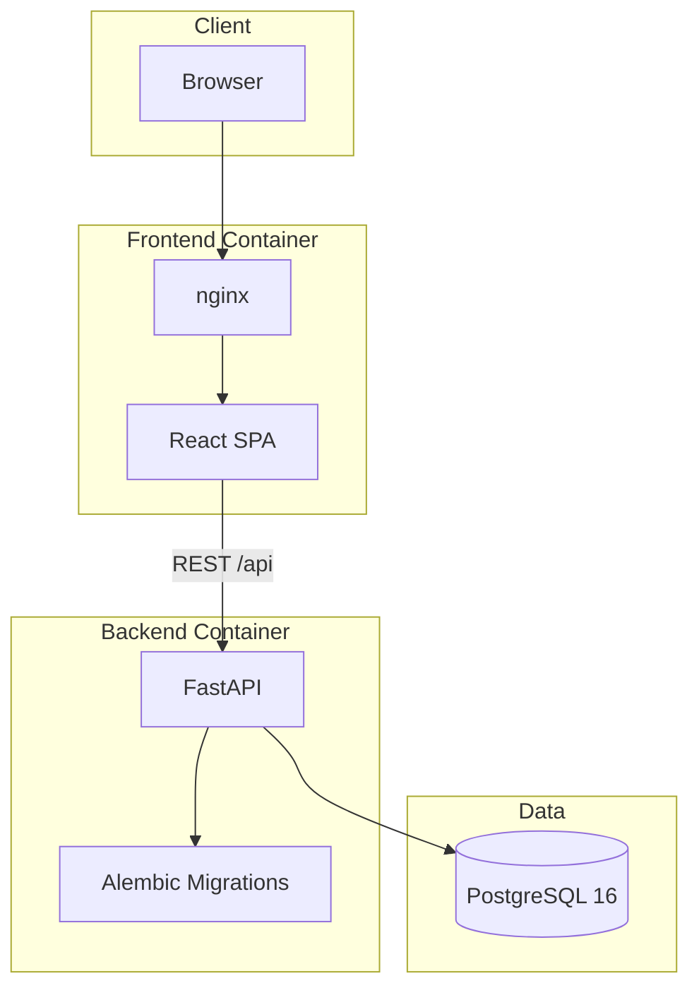

# Architecture

## Components


```mermaid
flowchart TB
  subgraph client [Client]
    Browser[Browser]
  end

  subgraph frontend [Frontend Container]
    Nginx[nginx]
    SPA[React SPA]
    Nginx --> SPA
  end

  subgraph backend [Backend Container]
    API[FastAPI]
    Alembic[Alembic Migrations]
    API --> Alembic
  end

  subgraph data [Data]
    PG[(PostgreSQL 16)]
  end

  Browser --> Nginx
  SPA -->|REST /api| API
  API --> PG
```

| Layer | Technology | Port |
|-------|------------|------|
| Frontend | React, TypeScript, Vite, nginx | 80 (container) |
| Backend | FastAPI, SQLAlchemy async, Alembic | 8000 |
| Database | PostgreSQL 16 | 5432 |

## Directory structure

```
prompt-db/
├── backend/
│   ├── app/              # FastAPI application
│   ├── alembic/          # DB migrations
│   ├── Dockerfile
│   └── entrypoint.sh     # Migration + seed on startup
├── frontend/
│   ├── src/              # React UI
│   ├── nginx.conf.template
│   └── Dockerfile
├── k8s/                  # Kubernetes manifests
├── scripts/              # Helper scripts
├── docs/                 # Documentation
├── docker-compose.yml
├── VERSION               # Semver (single source of truth)
└── .github/workflows/    # GitHub Actions CI/CD
```

## Authentication

- JWT access token (short-lived) + refresh token (rotation with `jti` in DB)
- Password hashing with bcrypt
- Rate limiting on auth endpoints

## Prompt model

| Field | Description |
|-------|-------------|
| Title, text, description | Content |
| Model | Free text / from meta list |
| Task (`task`) | Category |
| Tags | List |
| Visibility | `private` or `public` |

Private prompts are visible only to the owner. Foreign resources return **404** (no information leak via 403).

## API

Base URL: `/api`

| Method | Path | Auth |
|--------|------|------|
| POST | `/auth/register` | No |
| POST | `/auth/login` | No |
| POST | `/auth/refresh` | Refresh token |
| GET | `/auth/me` | Yes |
| GET/POST | `/prompts` | Yes |
| PATCH/DELETE | `/prompts/{id}` | Owner |
| GET | `/meta` | No |

OpenAPI at `/docs` only when `ENVIRONMENT=development`.

## Container images

Two separate images:

- **prompt-db-backend** – Python app, runs migrations on startup
- **prompt-db-frontend** – Static build + nginx with CSP

Build and versioning: [ci-cd.md](./ci-cd.md)
