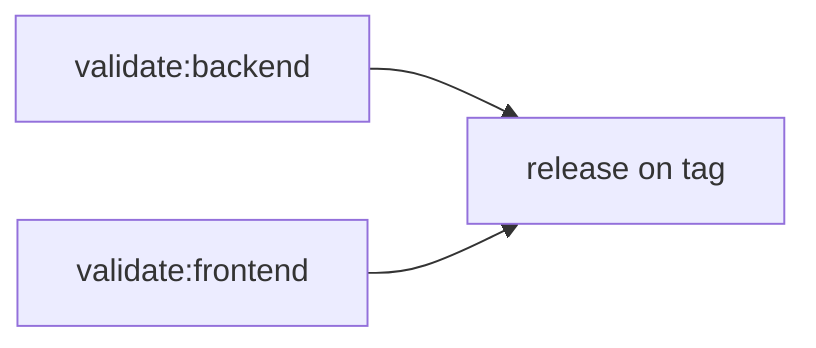

# CI/CD mit GitHub Actions

Die Workflows unter [`.github/workflows/`](../.github/workflows/) validieren Pull Requests, bauen Container-Images und erstellen Releases.

## Pipeline-Überblick



| Workflow | Auslöser | Zweck |
|----------|----------|-------|
| `ci.yml` | Push/PR auf `main` | Python-Syntax, Alembic-Historie, Frontend-Build |
| `release.yml` | Git-Tag `v*.*.*` | Images nach GHCR pushen, GitHub Release |

Build- und Release-Jobs laufen nur bei semver Git-Tags (`v1.2.3`).

## Versionierung

Die **Single Source of Truth** ist die Datei [`VERSION`](../VERSION) im Repository-Root.

| Ort | Verwendung |
|-----|------------|
| `VERSION` | Releases, Docker-Build, API, UI |
| Git-Tag `v1.2.3` | Löst Release-Pipeline aus; Image-Tag `1.2.3` |
| `frontend/package.json` | Sollte mit `VERSION` übereinstimmen |

### Release erstellen

```bash
echo "1.1.0" > VERSION
git add VERSION
git commit -m "Release 1.1.0"
git tag v1.1.0
git push origin main
git push origin v1.1.0
```

Die Pipeline erzeugt u. a.:

- `ghcr.io/erlkoenig91/prompt-db-backend:1.1.0`
- `ghcr.io/erlkoenig91/prompt-db-frontend:1.1.0`

Zusätzliche Tags: `${{ github.sha }}`, `latest`

Optional mit Pre-Release-Suffix: `v1.0.0-rc.1`

## GitHub einrichten

### 1. Repository auf GitHub anlegen

```bash
git remote add origin git@github.com:erlkoenig91/prompt-db.git
git push -u origin main
```

### 2. Container Registry (GHCR)

Images werden automatisch nach **GitHub Container Registry** gepusht:

```
ghcr.io/erlkoenig91/prompt-db-backend:<tag>
ghcr.io/erlkoenig91/prompt-db-frontend:<tag>
```

Unter **Package settings** das Paket ggf. auf **public** stellen, wenn das Repo öffentlich ist.

### 3. Actions-Variablen

| Variable | Pflicht | Beschreibung |
|----------|---------|--------------|
| `VITE_API_URL` | Optional | Öffentliche Backend-URL für den Frontend-Build (getrennte API-Domain) |

Leer lassen, wenn das Frontend die API über den eingebauten nginx-Proxy (`/api/`) anspricht.

`GITHUB_TOKEN` reicht für Push nach GHCR – kein separates Registry-Secret nötig.

## Images lokal nutzen

Mit Personal Access Token (`read:packages`):

```bash
echo $GITHUB_TOKEN | docker login ghcr.io -u erlkoenig91 --password-stdin
docker pull ghcr.io/erlkoenig91/prompt-db-backend:1.0.0
docker pull ghcr.io/erlkoenig91/prompt-db-frontend:1.0.0
```

Oder das lokale Skript:

```bash
export VITE_API_URL=https://api.example.com
./scripts/build-images.sh ghcr.io/erlkoenig91 1.0.0
```

## Kubernetes-Deployment mit CI-Images

In `k8s/backend.yaml` und `k8s/frontend.yaml` anpassen:

```yaml
image: ghcr.io/erlkoenig91/prompt-db-backend:1.0.0
```

Rollout nach neuem Tag:

```bash
kubectl set image deployment/prompt-db-backend \
  backend=ghcr.io/erlkoenig91/prompt-db-backend:1.0.0 \
  -n prompt-db
kubectl set image deployment/prompt-db-frontend \
  frontend=ghcr.io/erlkoenig91/prompt-db-frontend:1.0.0 \
  -n prompt-db
```

Details: [deployment.md](./deployment.md)

## Fehlerbehebung

| Problem | Lösung |
|---------|--------|
| Release-Workflow startet nicht | Tag muss `v1.2.3` Format haben und auf `main` gepusht sein |
| Frontend ruft falsche API auf | `VITE_API_URL` in GitHub Actions Variables setzen und Release neu bauen |
| `denied: installation not allowed` | Workflow braucht `packages: write` (bereits in `release.yml`) |
| CI schlägt bei Frontend fehl | `npm ci` lokal testen; `VERSION`-Datei muss existieren |
