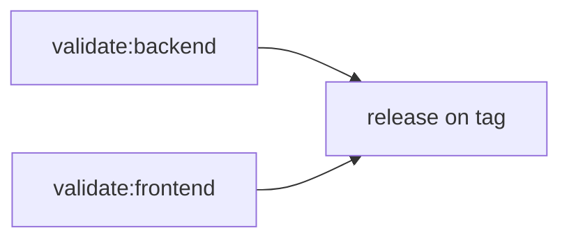

# CI/CD with GitHub Actions

Workflows under [`.github/workflows/`](../.github/workflows/) validate pull requests, build container images, and create releases.

## Pipeline overview


```mermaid
flowchart LR
  V1[validate:backend] --> R[release on tag]
  V2[validate:frontend] --> R
```

| Workflow | Trigger | Purpose |
|----------|---------|---------|
| `ci.yml` | Push/PR to `main` | Python syntax, Alembic history, frontend build |
| `release.yml` | Git tag `v*.*.*` or manual | Push images to GHCR, GitHub Release |

Release builds use native `ubuntu-latest` (amd64) and `ubuntu-24.04-arm` (arm64) runners, then merge multi-arch manifests.

## Versioning

The **single source of truth** is [`VERSION`](../VERSION) in the repository root.

| Location | Usage |
|----------|-------|
| `VERSION` | Releases, Docker build, API, UI |
| Git tag `v1.2.3` | Triggers release pipeline; image tag `1.2.3` |
| `frontend/package.json` | Should match `VERSION` |

### Create a release

```bash
echo "1.1.0" > VERSION
git add VERSION
git commit -m "Release 1.1.0"
git tag v1.1.0
git push origin main
git push origin v1.1.0
```

The pipeline produces:

- `ghcr.io/erlkoenig91/prompt-db-backend:1.1.0`
- `ghcr.io/erlkoenig91/prompt-db-frontend:1.1.0`

Additional tags: `${{ github.sha }}`, `latest`

Pre-release suffix is supported: `v1.0.0-rc.1`

Manual re-run without a new tag:

```bash
gh workflow run release.yml --ref main
```

## GitHub setup

### 1. Create the repository on GitHub

```bash
git remote add origin git@github.com:erlkoenig91/prompt-db.git
git push -u origin main
```

### 2. Container registry (GHCR)

Images are pushed automatically to **GitHub Container Registry**:

```
ghcr.io/erlkoenig91/prompt-db-backend:<tag>
ghcr.io/erlkoenig91/prompt-db-frontend:<tag>
```

Under **Package settings**, set the package to **public** if the repo is public.

### 3. Actions variables

| Variable | Required | Description |
|----------|----------|-------------|
| `VITE_API_URL` | Optional | Public backend URL for the frontend build (separate API domain) |

Leave empty if the frontend calls the API via the built-in nginx proxy (`/api/`).

`GITHUB_TOKEN` is sufficient for GHCR push — no separate registry secret needed.

## Use images locally

With a personal access token (`read:packages`):

```bash
echo $GITHUB_TOKEN | docker login ghcr.io -u erlkoenig91 --password-stdin
docker pull ghcr.io/erlkoenig91/prompt-db-backend:1.0.0
docker pull ghcr.io/erlkoenig91/prompt-db-frontend:1.0.0
```

Or use the local script:

```bash
export VITE_API_URL=https://api.example.com
./scripts/build-images.sh ghcr.io/erlkoenig91 1.0.0
```

## Kubernetes deployment with CI images

Adjust in `k8s/backend.yaml` and `k8s/frontend.yaml`:

```yaml
image: ghcr.io/erlkoenig91/prompt-db-backend:1.0.0
```

Rollout after a new tag:

```bash
kubectl set image deployment/prompt-db-backend \
  backend=ghcr.io/erlkoenig91/prompt-db-backend:1.0.0 \
  -n prompt-db
kubectl set image deployment/prompt-db-frontend \
  frontend=ghcr.io/erlkoenig91/prompt-db-frontend:1.0.0 \
  -n prompt-db
```

Details: [deployment.md](./deployment.md)

## Troubleshooting

| Problem | Solution |
|---------|----------|
| Release workflow does not start | Tag must match `v1.2.3` and be pushed |
| Frontend calls wrong API | Set `VITE_API_URL` in GitHub Actions variables and rebuild |
| `denied: installation not allowed` | Workflow needs `packages: write` (already in `release.yml`) |
| CI fails on frontend | Test `npm ci` locally; `VERSION` file must exist |
| arm64 build fails with QEMU | Use the current `release.yml` (native ARM runners) |
